1 引言

1.1 编写目的
本文档旨在对《拴正人家系统》的功能及操作方法进行描述，帮助用户掌握该系统的使用方法。

1.2 适用对象
本文档适用于测试人员、管理人员、用户等使用该系统的操作人员。

1.3 通用操作说明
【搜索】按钮：查询符合条件的信息。
【添加】按钮：打开新建窗口，新建相应类型的信息。
【修改】按钮：打开修改窗口，修改并保存当前数据行的详细信息。
【删除】按钮：删除当前数据行，删除时会有相应提示操作。
【导出】按钮：导出当前已选中的数据。
2 系统运行环境需求
硬件运行环境包括服务器硬件环境、客户端计算机硬件配置环境，详见下表。
表2.1-1 客户端计算机软硬件配置环境
配置	硬件规格要求
处理器	双核2.0G以上
内存	2G以上
硬盘	100G以上
显示器	分辨率：1920*1080；显示比例：100%
浏览器	谷歌浏览器；显示比例：100%

3 管理端功能介绍

3.1 登录系统
在浏览器地址栏中输入系统的访问地址，进入登录界面。在用户名框、密码框输入正确的用户登录名和密码，单击【登录】按钮即可登录本系统。系统将根据用户的身份及权限范围进入相应的系统主界面，若用户名、密码输入错误，或者不输入用户名、密码，则不能登录本系统。本文以系统管理员用户对系统功能进行描述。
 
3.2 首页 
首页中主要展示了用户数等各项数据统计
 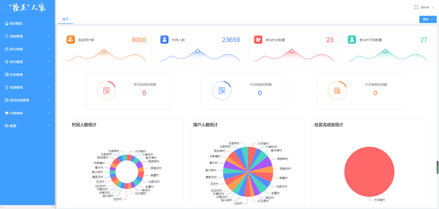

3.3 信息管理

3.3.1 拴正释义
点击菜单中的信息管理-拴正释义即可进入该页面，在该页面可设置拴正释义的主图以及视频，也可对拴正释义进行文字描述的设置，设置完成后即可在小程序端进行浏览查看
 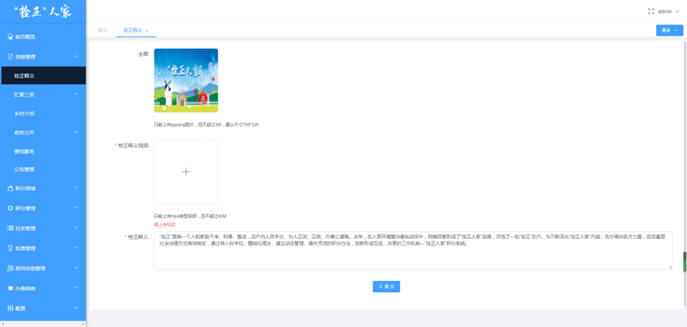

3.3.2 汇聚三农-优秀村户
点击信息管理-汇聚三农-优秀村户即可进入该页面，在该页面下可对优秀村户进行设置，点击新增按钮即可弹出新增优秀村户的对话框
 
 
在优秀村户列表操作栏中可进行修改以及删除操作，点击编辑按钮即可弹出编辑的对话框，在对话框内输入要修改的内容后点击修改按钮即可修改成功
 
 
在操作栏中点击删除按钮后，系统会弹出是否确认删除的对话框，确定删除的话点击确定按钮，若不确定删除点击取消按钮即可
 
 
优秀村户页面可对名称、类型乡村进行筛选查询，输入好筛选条件后点击搜索按钮即可进行查询
 

3.3.3 汇聚三农-养殖种植政策
点击信息管理-汇聚三农-养殖种植政策即可进入该页面，在该页面可对养殖种植政策进行设置，点击新增按钮即可弹出新增政策的对话框，在对话框内合法输入内容后点击保存按钮即可新增成功
 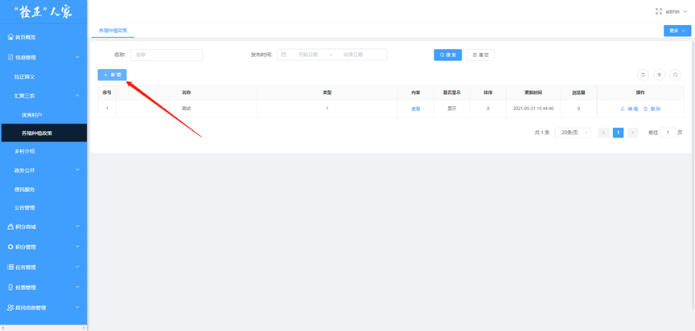
 
养殖种植政策页面，列表操作栏中可点击编辑和删除按钮进行相应操作，点击编辑按钮即可弹出编辑对话框
 
 
点击操作栏中的删除按钮即可弹出询问是否删除的对话框，在对话框内点击确定按钮即可删除成功，点击取消按钮对话框消失，删除操作取消
 
 
3.3.4 乡村介绍
点击信息管理-乡村介绍即可进入该页面，在该页面中默认选中的是大河塔镇，可对大河镇的介绍文字以及图片进行设置，设置完成后可登录小程序进行浏览查看
 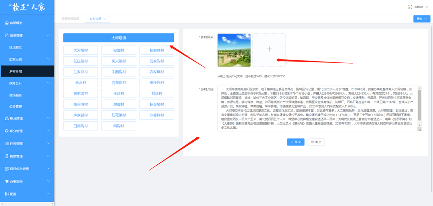
乡村介绍页面，可选择相应的村进行乡村介绍的设置
 
3.3.5 政务公开-栏目管理
点击信息管理-政务公开-栏目管理即可进入该页面，在该页面点击新增按钮即可弹出新增对话框，在对话框内输入相应内容后点击保存按钮即可新增成功
 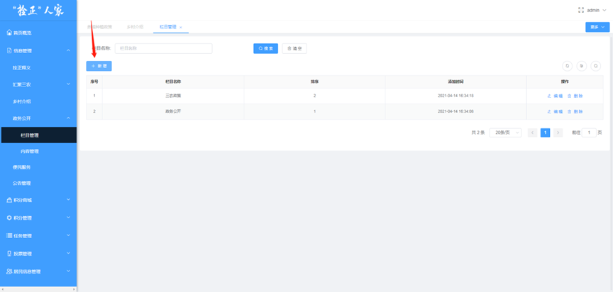
 
栏目管理页面，列表操作栏中可进行编辑和删除操作，点击编辑按钮即可弹出编辑对话框，修改完成后点击修改按钮即可
 
 	栏目管理页面，列表操作栏中点击删除按钮即可弹出询问删除的对话框，点击对话框内得确定按钮即可删除
 
 
3.3.6 政务公开-内容管理
点击信息管理-政务公开-内容管理即可进入该页面，在该页面点击新增按钮即可弹出新增的对话框，在对话框内输入相应的内容后点击保存按钮即可完成内容的新增 
 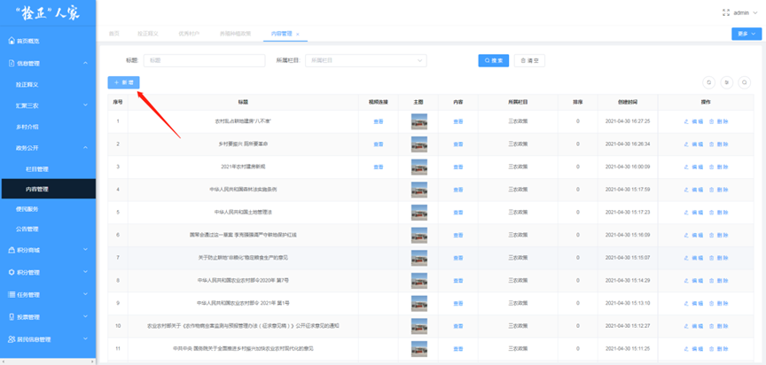
 
内容管理页面，列表操作栏中可进行编辑或删除操作，点击编辑按钮即可弹出编辑的对话框，在对话框中输入修改后的内容后点击修改按钮即可完成修改
 

 
内容管理页面，列表操作栏中点击删除按钮即可弹出询问删除的对话框，点击对话框内的确定按钮即可完成删除
 
 
3.3.7 公告管理
点击信息管理-公告管理即可进入该页面，在该页面中点击新增按钮即可弹出新增对话框，在对话框内输入相应的内容后点击保存按钮即可完成新增
 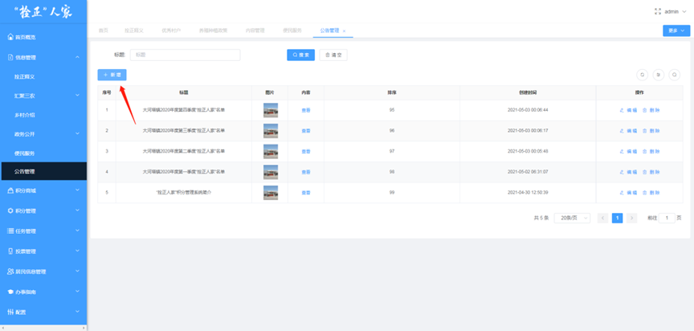
 
公告管理页面，列表操作栏中可进行编辑和删除操作，点击编辑按钮页面将弹出修改的对话框，在对话框内输入相应的内容后点击保存按钮即可完成修改
 
 
公告管理页面，列表操作栏中点击删除按钮，页面会弹出询问删除的对话框，点击对话框内的确定按钮即可完成删除，点击取消按钮，对话框消失，取消删除操作
 
 
公告管理页面，列表可根据标题进行筛选查询，输入框内输入关键字或标题全称后点击搜索按钮即可完成查询操作
 
3.4 积分商城

3.4.1 商品分类
点击积分商城-商品分类即可进入该页面，在该页面点击新增按钮即可弹出新增的对话框，在对话框内输入相应的内容后点击保存按钮即可完成新增操作
 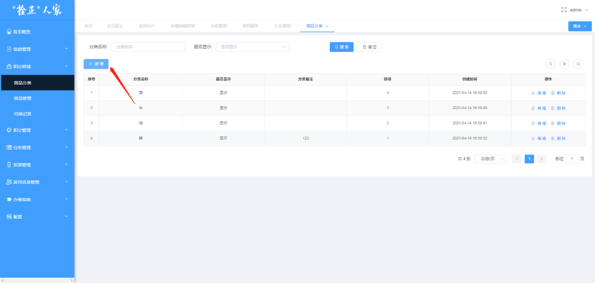
 
商品分类页面，列表操作栏中可进行编辑和删除操作，点击编辑按钮页面将弹出修改的对话框，在对话框内输入相应的内容后点击修改按钮即可完成修改
 
 
商品分类页面，点击列表操作栏中的删除按钮即可弹出询问删除的对话框，点击对话框内的确定按钮即可完成删除操作，点击对话框内取消按钮则删除操作取消
 
 
商品分类页面，列表数据可根据分类名称以及是否显示进行筛选查询
 
3.4.2 商品管理
点击积分商城-商品管理即可进入该页面，在该页面可对商品进行设置，点击新增按钮即可弹出新增对话框，在对话框中输入商品的相关内容后点击保存按钮即可完成添加
 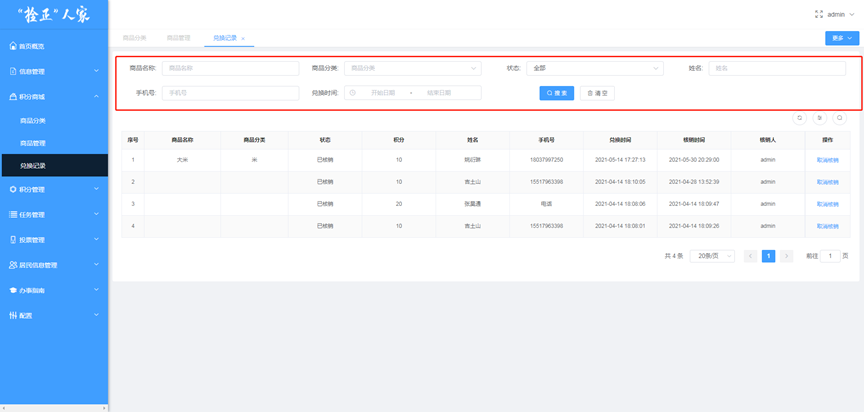
 
商品管理页面，可对已添加的商品进行编辑、删除以及查看该商品的兑换记录等进行操作。点击操作栏中的编辑按钮即可弹出修改的对话框，在对话框内输入要修改的内容后点击修改按钮即可完成修改
 
 
商品管理页面，在列表操作栏点击删除按钮，系统会弹出询问删除的对话框，在对话框内点击“确定”按钮即可完成删除操作
 
 
商品管理页面，在列表中点击内容按钮，系统右侧会弹出该商品的内容详情
 
 
商品管理页面，在列表操作栏点击兑换记录按钮，系统会弹出，兑换记录的对话框，在对话框内显示了该商品的兑换记录列表，且在对话框上方可进行筛选查询
 
 
商品管理页面，页面上方可根据商品名称、所属分类进行筛选查询
 
3.4.3 兑换记录
点击积分商城-兑换记录即可进入该页面，在该页面上方可根据筛选条件进行筛选查询
 
兑换记录页面展示了兑换记录列表，在列表操作栏中点击取消核销按钮即可弹出询问是否取消核销的对话框，在对话框内点击确定按钮即可完成该项操作
 
 
3.5 积分管理

3.5.1 积分记录
点击积分管理-积分记录即可进入到该页面，该页面展示了积分对象所有的增加和减少积分的列表记录
 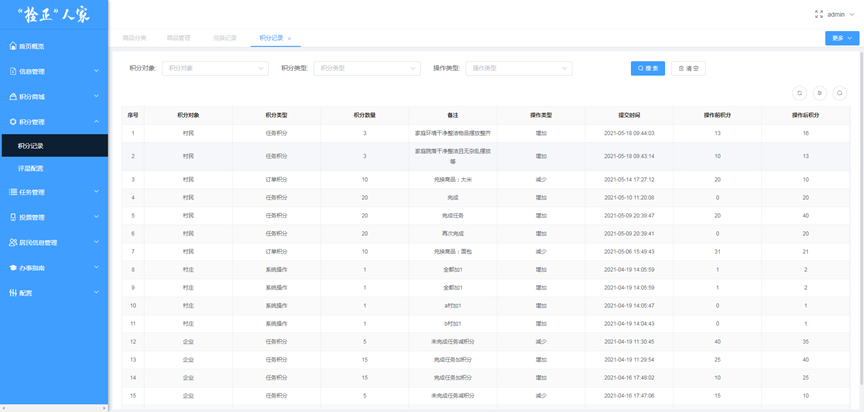
积分记录页面上方可根据筛选条件进行有目标的查询数据操作
 
3.6 任务管理

3.6.1 任务列表
点击任务管理-任务列表即可进入该页面，在该页面可进行积分任务的新增、编辑、删除等操作，点击新增按钮即可弹出新增活动的对话框，在对话框内输入活动的相关内容后点击保存按钮即可完成新增任务
 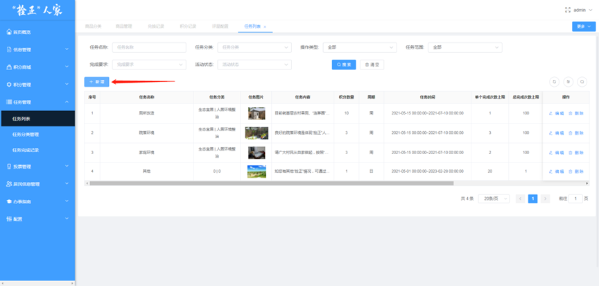
 
任务列表页面，列表操作栏中可对任务进行编辑、删除等操作，编辑修改任务只能修改还未开始的任务，若任务已经开始了则不允许修改
 
 
任务列表页面，列表操作栏中可点击删除按钮系统会弹出询问删除的对话框，在对话框内点击确定按钮即可完成删除操作
 
任务列表页，页面上方可根据筛选条件尽心筛选查询
 
3.6.2 任务分类管理
点击任务管理-任务分类管理即可进入该页面，在该页面可对拴正人家、拴正村庄、拴正企业的任务分类进行设置，点击列表右上方的这三个按钮即可对对象进行选中设置
 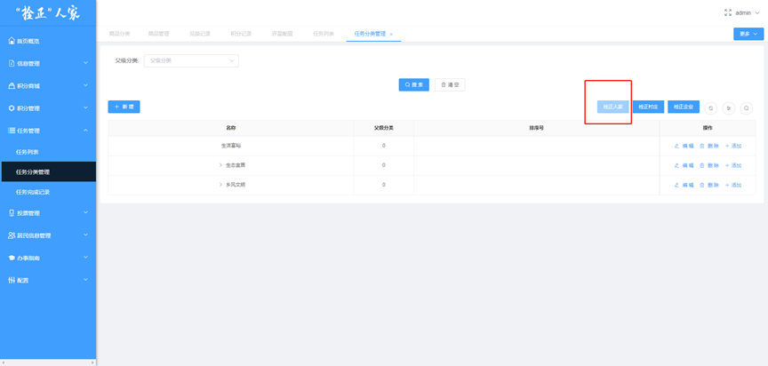
任务分类管理页面，在列表操作栏中可对分类进行新增、编辑、删除、添加等操作，点击新增按钮，系统会弹出新增分类的对话框，在对话框内输入相应的分类内容后点击保存按钮即可完成添加
 
 
列表操作栏中点击编辑按钮，系统会弹出编辑的对话框，在对话框内输入要修改的内容后点击修改按钮即可完成修改
 
列表操作栏中点击 删除按钮，系统会弹出询问是否删除的对话框，在对话框内点击确定按钮即可完成删除操作
 
 
列表操作栏中点击添加按钮即可弹出该新增分类对话框，但此操作是为该项分类增加子分类，在新增对话框中点击保存按钮即可完成新增操作
 
 
任务分类管理页面上方可根据筛选条件进行筛选查询
 
3.6.3 任务完成记录
点击任务管理-任务完成记录即可进入该页面，在该页面展示了所有任务对象提交的任务数据
 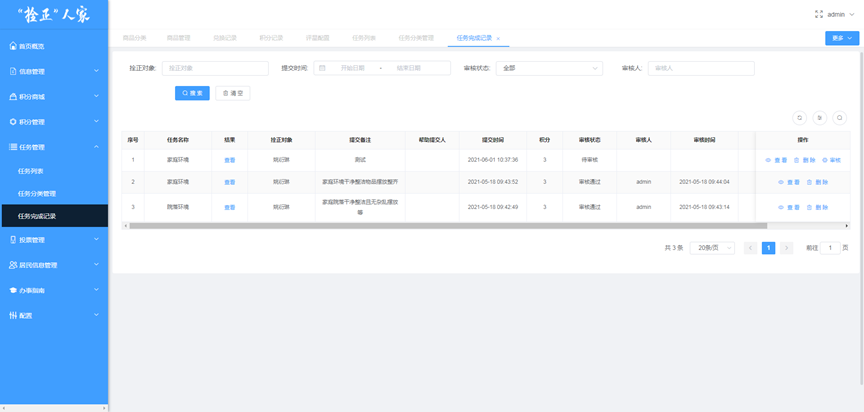
在列表操作栏中可进行查看、删除、审核操作。点击查看按钮即可弹出用户提交任务详情
 
 

在列表操作栏中点击删除按钮即可弹出询问删除的对话框，在对话框内输入删除原因也可上传图片后点击提交按钮即可完成删除操作
 
 
任务完成记录页面上方可根据筛选条件进行查询
 
3.7 投票管理

3.7.1 投票信息管理
点击投票管理-投票信息管理即可进入该页面，该页面可对投票活动进行新增、编辑、删除、投票选项、积分设置等操作。点击新增按钮即可弹出新增投票活动的对话框，在对话框内输入活动的相关内容后点击保存按钮即可完成新增
 
 
在列表操作栏中点击编辑按钮即可弹出修改的对话框，输入完成修改后的内容后点击修改按钮即可完成修改操作
 
 
列表操作栏中可进行删除操作，点击删除按钮系统会弹出询问是否删除的对话框，点击对话框内的确定按钮即可完成删除操作
 
 
在列表操作栏中可对投票对象进行设置，点击投票选项，页面会弹出投票对象设置的对话框，在对话框内可进行投票对象的新增、编辑、删除以及查看投票记录等操作
 
 
在投票选项对话框中可点击导出按钮导出Excel表格进行查看
 
投票信息管理列表页可进行对第几名到第几名进行积分奖励的设置操作，点击积分设置按钮即可弹出积分设置的对话框，在该对话框内点击新增按钮可设置积分数据
 
 
投票信息管理页面上方可根据筛选条件进行筛选查询
 
3.7.2 投票记录管理
点击投票管理-投票记录管理即可进入到该页面，该页面展示了所有投票人的投票信息
 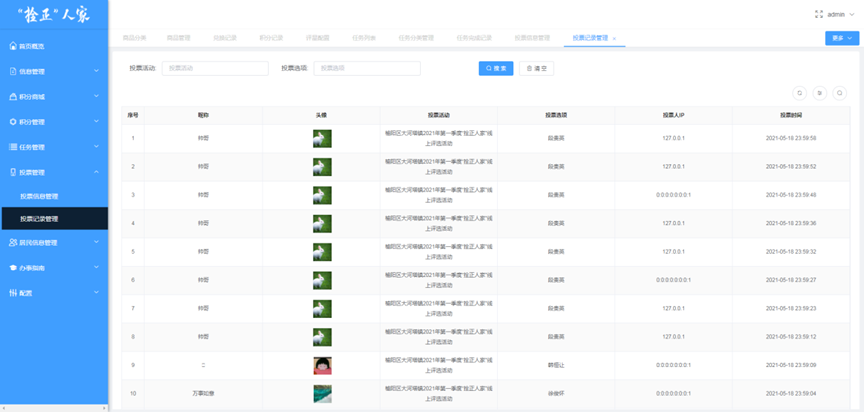
页面上方可根据筛选条件进行筛选查询
 
3.8 居民信息管理

3.8.1 组织结构
点击居民信息管理-组织结构即可进入该页面，该页面可对大河塔镇管辖下的村以及村组织进行设置，点击添加按钮后输入乡村名称后点击保存按钮即可完成添加
 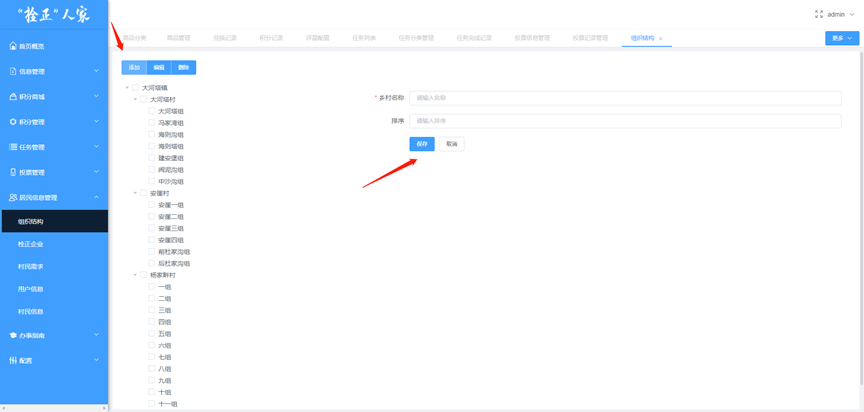
点击编辑按钮可对镇、村、大队进行编辑修改
 
点击删除按钮可对对象进行删除，系统会弹出询问删除的对话框，点击对话框内的确定按钮即可完成
 
 
3.8.2 拴正企业
点击居民信息管理-拴正企业即可进入该页面，该页面展示了拴正企业的相关内容，可对拴正企业进行设置。点击新增按钮即可弹出新增拴正企业的对话框，在对话框中输入相关的企业信息后点击保存按钮即可完成对企业的新增
 
 
拴正企业页面，点击列表操作栏中的编辑按钮即可弹出修改对话框，在对话框内输入修改后的信息后点击修改按钮即可完成编辑
 
 

拴正企业页面，列表操作栏中点击删除按钮即可弹询问删除的对话框，点击对话框内的确定按钮即可完成删除操作
 
 
拴正企业页面，列表操作栏中可对企业做设置积分、完成任务、查看积分记录等操作，点击更多操作按钮，按钮下方弹出相应的操作按钮
 
3.8.3 村民需求
点击居民信息管理-村民需求即可进入该页面，该页面展示了用户在小程序端提交的需求数据
 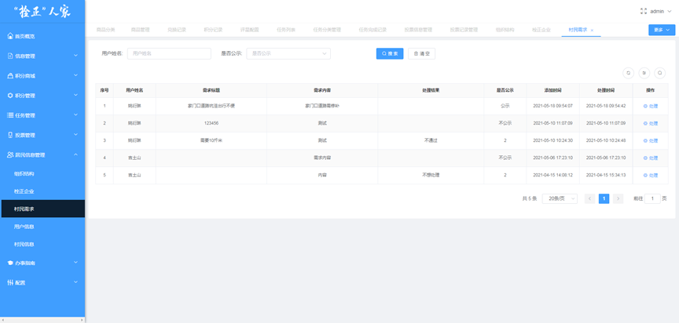
点击操作栏中的处理按钮即可弹出处理的对话框，在对话框即可对是否公示需求进行处理
 
 
3.8.4 用户信息
点击居民信息管理-用户信息即可进入到该页面，该页面展示了所有身份的用户数据，可在该页面进行用户的新增、编辑、家庭成员、管辖范围等设置。点击新增按钮即可弹出新增对话框，在该对话框内输入相应的人员信息后点击保存按钮即可完成新增操作
 
 
点击编辑按钮即可弹出编辑的对话框，编辑完成后点击修改按钮即可完成修改
 
 
点击列表操作中的更多操作按钮，按钮下方会弹出家庭成员、管辖范围（身份为村干部、包村干部才会弹出）等操作按钮，点击家庭成员按钮会弹出家庭成员列表对话框；点击管辖范围即可对其管辖的村或大队进行设置
 
页面上方可根据筛选条件进行筛选查询
 
3.9 办事指南

3.9.1 办事指南列表
点击办事指南-办事指南列表即可进入该页面，该页面可对办事指南进行新增、编辑、删除、审核流程等进行设置，点击新增按钮即可弹出新增对话框，在对话框中输入相应内容后点击保存按钮即可完成新增操作
 
 
点击编辑按钮即可弹出编辑的对话框，在对话框内输入修改后的内容后点击修改按钮即可完成编辑操作
 
 

办事指南页面，点击列表操作栏中的删除按钮会弹出询问删除的对话框，在对话框内点击确定按钮即可完成删除操作
 
 
3.9.1.1 设置办事指南流程审核员
办事指南页面，点击列表操作栏中的审核流程按钮，会弹出审核流程对话框，在对话框内点击新增按钮即可设置该指南的审核流程，设置所属村庄以及审核人员
 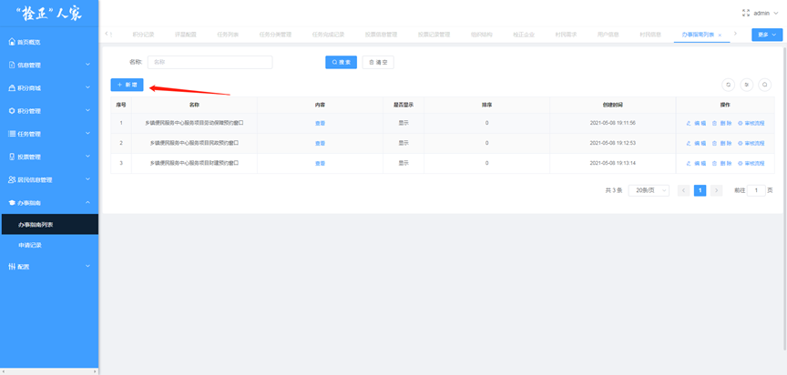
 
办事指南中如果想要某个人为该项指南大河塔乡政府的审核员，需要将这个人的身份改为村干部且需要把这个人的管辖范围更改为大河塔乡政府，例如把这个用户的身份先改为村干部
 
改为村干部后还需要将该审核员的管辖范围改为大河塔乡政府即可
 
 
改完身份和管辖范围后即可选择该名用户为审核员
 

3.9.2 申请记录
点击办事指南-申请记录即可进入该页面，在该页面显示了用户上传的申请记录，点击列表操作栏中的审核记录按钮，系统右侧会弹出审核的详情信息
 
 
申请记录页面，点击列表操作栏中的打印按钮即可弹出打印对话框，在对话框内点击确认打印按钮连接打印机后即可打印
 
 

4 小程序端功能介绍

4.1 登录小程序
小程序端登录输入在管理端配置好的账号进入小程序，需输入手机号以及手机验证码正确后方可登录
 

4.2 小程序端首页
小程序首页包含了拴正释义区、动态公告区、功能金刚区、村镇简介区、优秀村户区、三农政策区、政务公开等区域。

4.2.1 拴正释义
点击首页上方的拴正释义区的图片即可跳转至拴正释义页面
       

4.2.2 动态公布
点击动态公布按钮页面会跳转至公告列表
       
在公告列表中点击某个公告或在首页动态公布处直接点击公告标题即可进入公告详情页
     
4.2.3 汇聚三农
功能金刚区内点击汇聚三农按钮即可跳转至汇聚三农页面，汇聚三农页面包含了优秀村户、养殖种植政策。点击优秀村户下的图片可直接进入优秀村户的详情页
     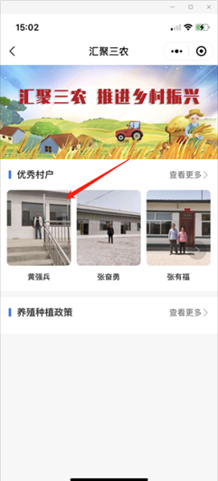

点击详情页右下角的分享按钮可分享至微信朋友以及朋友圈（苹果系统不可分享至朋友圈）
 
可在汇聚三农首页点击查看更多按钮进入列表页进行浏览
    
汇聚三农首页，可点击养殖种植政策的查看更多按钮进入列表页
 
4.2.4 积分任务
点击功能金刚区的积分任务按钮接口跳转至积分任务列表页
    
积分任务列表页，用户可选择某项任务进行提交，点击做任务按钮即可跳转至任务详情页，任务详情页右下角点击完成任务按钮即可进入完成任务页面，在完成任务页面提交完成所需要的要求后点击提交完成按钮即可
    
积分任务详情页可点击分享按钮对该任务进行分享
 
4.2.5 积分商城
在首页点击积分商城按钮即可跳转至积分商城列表页，列表页展示可以兑换的各样商品
   
用户可点击想要选择商品进行对话，点击想要兑换的商品图片进入商品详情页，在详情页点击立即兑换按钮，系统弹出确认兑换的询问提示框，在提示框内点击确认兑换按钮（积分以及商品库存足够）即可兑换成功，如果积分或库存不足系统会给出相应提示
   
积分商城列表页，商品右上方的“兑换记录”按钮即可查看自己的兑换商品的记录
    
4.2.6 线上投票
金刚区中点击线上投票按钮即可进入线上投票列表页，点击列表页中正在进行投票活动即可进入活动详情页
       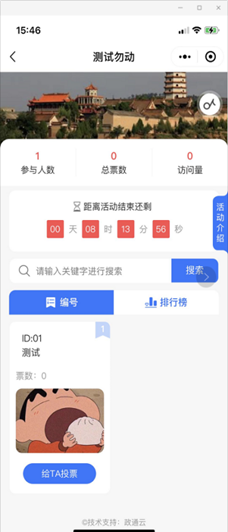

投票活动详情页，给用户投票时点击给他投票会进入投票详情页，投票详情页点击给他投票后确认即可
    
4.2.7 便民服务
点击金刚区中的便民服务按钮即可跳转至便民服务列表页，在列表页可点击相应的服务跳转至相应的小程序
       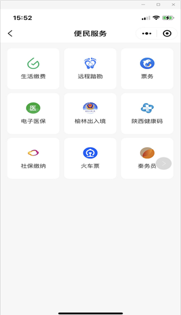

4.2.8 需求沟通
金刚区点击需求沟通按钮即可跳转至需求沟通页面，需求沟通页面点击提需求按钮即可跳转至提交需求页面，完成输入后点击确定按钮即可提交需求
     
需求沟通页面点击我的需求按钮即可跳转至的我的需求列表页，列表页记录了我提过的所有需求
     
4.2.9 自愿申报
金刚区点击资源申报按钮即可跳转至指定的积分任务详情页
    
4.2.10 办事指南
金刚区点击办事指南按钮即可跳转至办事指南列表页，在列表可选择相应的业务进行预约
     
选择好相应的业务后进行点击跳转至业务详情页，在详情页点击开始预约按钮跳转至预约页面，在预约页面输入相应的内容后点击确认预约按钮即可完成业务预约
    
4.2.11 村镇简介
点击村镇简介的主图或查看更多按钮可跳转至村镇简介页面，在该页面简单描述了大河塔镇的简介描述，点击下方的村即可跳转至该村的简介页面
       

4.2.12 优秀村户
点击优秀村户的个人图片可直接跳转至该村户的详情页
     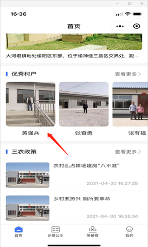
点击优秀村户的查看更多按钮即可跳转至优秀村户的列表页
   
4.2.13 三农政策
点击三农政策下的某条标题即可进入该项数据的详情页
    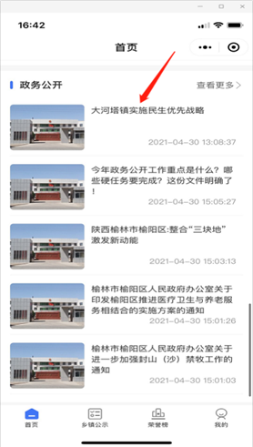
三农政策详情页可点击有下角的分享进行微信好友及朋友圈的分享
 
4.2.14 政务公开
点击政务公开下的某条数据即可跳转至该项数据的详情页
   
4.3 乡镇公示
点击底部导航栏的乡镇公示按钮即可进入乡镇公式页面，在该页面展示推介村民、待整改村民、黑名单

4.3.1 推介村民
推介村民列表展示了村民在提交了完成任务后被审核员审核通过并给予积分奖励的村民进行公示
 
4.3.2 待整改村民
待整改村民列表展示了被审核员发送了待整改任务（扣分）的村民进行公示
 
4.3.3 黑名单
黑名单列表展示了被管理员审核扣分的村民进行公示
 

4.4 荣誉榜
点击底部导航栏的荣誉榜按钮即可进入荣誉榜榜单页面界面，在该界面默认展示居民榜排行，可点击驻村干部榜、村庄榜、村干部榜、企业榜等进行切换展示
 
4.5 我的
点击底部导航栏可进入我的页面，在我的页面可进行家庭成员的管理设置以及查询各项与我有关的数据如：积分、兑换商品的记录、我参与的投票、我的需求、我的任务记录、我的办事预约记录等
 

4.6 村干部管理

4.6.1 村干部首页
当身份为村干部的用户进入我的页面是会出现村干部管理的入口，点击该入口即可进入村干部管理首页
    
村干部管理首页包含村任务以及该村干部管辖下的村民信息，村任务与村民的积分任务一致，针对的对象为村，只有村干部可以完成村任务；村干部可对村民的任务以及家庭成员管理进行查看与设置，点击查看任务按钮即可打开该人员的任务记录
    
点击家庭成员管理即可跳转至该村民的家庭成员信息管理页面，可对该村民的家庭成员进行增删改等操作，点击添加家庭成员按钮后即可跳转至新增页面，输入信息后点击确认提交即可
      

4.6.2 排行榜
点击底部导航栏中的排行榜按钮即可进入排行榜页面

4.6.3 我的
点击底部我的按钮即可进入我的页面，我的页面有积分记录和任务记录，点击积分记录按钮即可进入本村的积分记录页面，积分记录页面可点击积分排行榜跳转至排行榜页面
     
点击任务记录按钮跳转至本村任务记录页面
     

4.7 包村干部管理
包村干部功能与村干部一致，但无村级任务以及任务记录选项

4.8 巡查员管理

4.8.1 巡查登记
巡查员管理巡查登记页面，该列表仅展示扣分任务，点击该任务即可进入该任务的详情页，在详情页点击完成任务按钮后进入完成任务页面，在该页面需要选择对象村民等信息进行提交
     
被巡查员选中并提交了待整改任务的村民，在其首页顶部会有红字提示其有待整改任务，请抓紧处理，点击红字提示后可进入待整改任务列表页
           
4.8.2 登记审查
村民回复后，巡查员在登记审查页面可查看到村民的回复信息，点击该信息可进入信息的详情页
    
巡查员在回复详情页中可根据村民的回复决定是扣分还是清除这次待整改任务，选择扣分意为：此次整改依然不合格；清除意为：此次整改任务完成，不扣分，点击按钮均有提示点击确定即可
   
如需查看演示请联系客服.png)